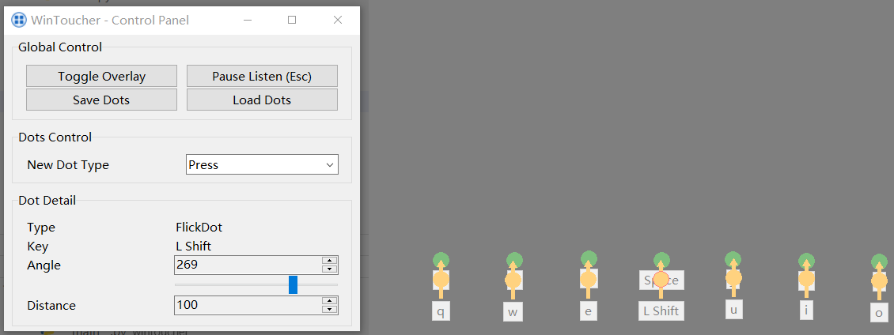

> [!NOTE]
>
> WinToucher is still under development. The current version is a prototype and may contain bugs.

# WinToucher
Powered by Win32 API and tkinter, WinToucher is a Python application that allows you to simulate touch events on Windows through keyboard input. It is useful for testing touch-based applications on Windows without the need for a physical touch screen.

## Features
- 📝 Mark touch points on the screen (when the overlay is shown)
  - **Click blank space** to create a new touch point
  - **Double click touch point** to check its detail
  - **Drag touch point** to move it
  - **Right click touch point** to unset its key binding or delete it (if it is not bound to any key)
- 👇 Support actions of pressing and flicking
  - **Press**: Tap the touch point once
  - **Flick**: Drag the touch point to a certain direction and distance
- 📃 Save and load touch points (dots) in JSON format
- 👂 Global, togglable keyboard listener
- 👻 Hide window to the system tray

## To-do
- [ ] Fix bugs with touch simulation when calling `InjectTouchInput` in some certain cases
- [ ] Improve overlay GUI
- [ ] Try to build with `nuitka`

## License
[MIT](./LICENSE)